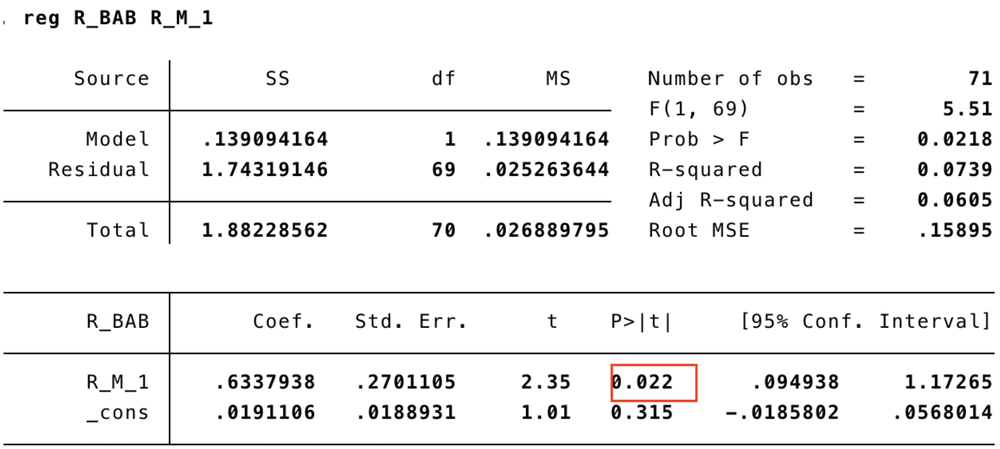

Content
---
\Large
* Problem set 1
	* Q(1): Regress Beta
	* Q(2): Test CAPM
* Problem set 2
	* Q(1): Beta associated with the BAB factor
	* Q(2): Benchmark to CAPM
	* Q(3): Plot return and construct a strategy
	* Design Strategy by Constructing a New Portfolio
* Reference
* Appendix
	* Code for Problem Set 1
		* RegressBeta.ipynb (Python code)
		* TestCAPM.ipynb (Python code)
	* Code for Problem Set 2
		* SortPortfolio.ipynb (Python code)

\normalsize

\pagebreak
# Problem set 1

## Q(1). Regress Beta

First, we downloaded data from CSMAR, and merge the csv file into one single dataframe, as following table shows:

Stkcd | Month	| ri |	rf |	rm
--|--|--|--|--
600000 |	2008-01 |	-0.128788 |	0.003386 |	-0.134478
600000 |	2008-02 |	-0.084130 |	0.003386 |	0.011720
600000 |	2008-03 |	-0.159744 |	0.003386 |	-0.189113
600000 |	2008-04 |	0.194758 |	0.003386 |	0.044477
600000 |	2008-05 |	-0.132099 |	0.003386 |	-0.087845

Then we dropped some stocks' data, to aviod abnormal result that might resulted from them. Therefore, for those stocks with less than 132 monthly return data, we simply drop them.

There were 1469 stocks, and only 293 remains after we dropped stocks without complete 132 months' return data.

According to CAPM model, we have $$ E(r_i)=r_f+\beta_i(E(r_m)-r_f) $$

To regress beta for each stock across a 5-year window, we regress (First-Pass):
$$ r_{it}-r_{ft}=\alpha_i+\beta_i(r_{mt}-r_{ft})+\epsilon_{it}$$

where $i$ stands for each stock and $t$ stands for each month in this 5-year window

Sample Beta Result:

Date | 600000 |	600004 |	600007 |	600008 |	600009 |	600011 |	600012 |
-- | -- | -- | -- | -- | -- | -- | --
2013-01 |	1.107955 |	0.765357 |	0.814966 |	0.967411 |	0.861140 |	0.695644 |	0.717668
2013-02 |	1.120298 |	0.765737 |	0.795829 |	0.948405 |	0.864654 |	0.655563 |	0.707989
2013-03 |	1.123275 |	0.766405 |	0.795683 |	0.946535 |	0.865976 |	0.655074 |	0.708128
2013-04 |	1.140774 |	0.739266 |	0.784726 |	0.883210 |	0.831195 |	0.599534 |	0.695682

And stocks with minimum / maximum beta are:

| Type     | Stock  | Date    | Beta                |
| -------- | ------ | ------- | ------------------- |
| Min Beta | 600594 | 2015-01 | -0.0638275048724565 |
| Max Beta | 600030 | 2018-09 | 2.1775508197632782  |

## Q(2): Test CAPM

In this question, we use Fama-Macbeth Regression to test CAPM.

First step is to do a Periodic Cross-Sectional Regression (Second-Pass):

$$ r_{it}-r_{ft} = \delta_0+\delta_1\beta_{it} $$

Then compute the mean and standard deviation of regressed $\delta_0$, $\delta_1$:

$$\hat \delta_0=\frac{1}{T}\sum_{t=1}^T \hat \delta_{0t}$$

$$\hat \delta_1=\frac{1}{T}\sum_{t=1}^T \hat \delta_{1t}$$

Then we use t-test to test whether CAPM holds, that is to say, $\hat \delta_{0}$ does not significantly $\ne$ 0

Regression result indicates that:

Coefficient | Mean | Standard deviation
--|--|--
$\delta_{0}$ | 0.015182963623538282 | 0.07706224576729304
$\delta_{1}$ | -0.008369189075356878 | 0.04809331279986916

T test result of $\delta_0$ (the constant term):

t statistic | p value
--|--
1.660137518947314 | 0.10129746647870715

The p-value is 10.13%, which means we fail to reject the null hypothesis (H0: $\delta_{0}$ $\ne$ 0) at 5% significance level. That is to say, $\hat \delta_{0}$ does not significantly $\ne$ 0

T test result of $\delta_1$ (the constant term):

t statistic | pvalue
--|--
-1.466316968482576 | 0.14697719583754815

The p-value is 14.70%, which means we fail to reject the null hypothesis (H0: $\delta_{1}$ $\ne$ 0) at 5% significance level. That is to say, $\hat \delta_{1}$ does not significantly $\ne$ 0

# Problem set 2

## Q(1): Beta associated with the BAB factor

Sort stocks according to their beta calculated in problem set 1, and then divided them into 10 bins as our portfolio.

The data of high / low beta portfolio is listed below, where 1 is the high beta portfolio and 10 is the low beta portfolio

Month | High Beta Portfolio |	Low Beta Portfolio
--|--|--
2013-01 |	1.3947639903450200 |	0.48675847752053300
2013-02 |	1.405691371946280	|0.48882493272096400
2013-03	| 1.4061350817178800|	0.48828831498392700
2013-04	| 1.4147694828270300|	0.4558221700934130
2013-05	| 1.4195780900237200|	0.45813178699020800
2013-06	| 1.425798658809230	|0.46249945851352500
2013-07	|1.4528169319016900	|0.434111216812808
2013-08	|1.4524993314469800	|0.4334145851698460
2013-09	|1.4363409808107600	|0.401121351806172
2013-10	|1.42971253629451	|0.40028707675927600
2013-11	|1.472229834622940	|0.3634489589579970
2013-12	|1.471923857893450	|0.3507959386332640
2014-01	|1.4746833650025300	|0.35472261988735600
2014-02	|1.4590549475881000	|0.35896255481844700
2014-03	|1.4603915078380000	|0.3538352278381550
2014-04	|1.4249397763662200	|0.34436719473658200
2014-05	|1.4228582658334500	|0.3383643030797850
2014-06	|1.41890950449866	|0.3442414262765690
2014-07	|1.4604317766206800	|0.33115680679588000
2014-08	|1.4715927203225000	|0.3479874708566510
2014-09	|1.5969353707625300	|0.3811754223285340
2014-10	|1.6198636274167900	|0.3725308483600890
2014-11	|1.6269973062027700	|0.3468944860200980
2014-12	|1.5630039179247000	|0.31140865668453600
2015-01	|1.4440526391381500	|0.2252900318514850
2015-02	|1.4592618016014400	|0.22965334560253800
2015-03	|1.457539744802600	|0.22949324706219600
2015-04	|1.458097023758330	|0.28181551045771100
2015-05	|1.4204681399034500	|0.32719325491508000
2015-06	|1.4190195480788800	|0.32916406737062800
2015-07	|1.398414234640780	|0.33100244191169900
2015-08	|1.3980122436354600	|0.35834814210003200
2015-09	|1.4041475694547300	|0.3805003957381610
2015-10	|1.4019725794525100	|0.3858736975865300
2015-11	|1.3946902360206500	|0.44883658286907500
2015-12	|1.4004971695408600	|0.4822454675754060
2016-01	|1.3963477876049200	|0.4869824145485100
2016-02	|1.406130241435370	|0.5506613438207790
2016-03	|1.39994768912204	|0.5489143597326280
2016-04	|1.4010953257292200	|0.5611007218148190
2016-05	|1.4011454335183600	|0.5610286694048800
2016-06	|1.3993886342425700	|0.5609558671559690
2016-07	|1.398211008902050	|0.5610631513090350
2016-08	|1.3979639957923800	|0.5654307930280990
2016-09	|1.3990996598658500	|0.567987734010002
2016-10	|1.3961692348721200	|0.5534962452538180
2016-11	|1.396762568436770	|0.5538640592420380
2016-12	|1.387529058589020	|0.5547601799513300
2017-01	|1.385591763305630	|0.546648362584477
2017-02	|1.3907229077057000	|0.5539119085082290
2017-03	|1.390632297106590	|0.5487884407878970
2017-04	|1.3927566766823400	|0.5454884143800170
2017-05	|1.3920192023819200	|0.5471638597485600
2017-06	|1.3900123245867600	|0.5466687263425300
2017-07	|1.3881889159750500	|0.5579185912628300
2017-08	|1.3830900649455000	|0.5540591130878820
2017-09	|1.380093346843890	|0.5568482849876030
2017-10	|1.3819329395954800	|0.5586389145120930
2017-11	|1.3773288502824800	|0.5577130508796900
2017-12	|1.379605380691550	|0.5456668275352700
2018-01	|1.393345694234990	|0.5319737134434310
2018-02	|1.389832416583570	|0.5255653115235560
2018-03	|1.390447068303690	|0.5297976192118310
2018-04	|1.3858016991994700	|0.5342828708939680
2018-05	|1.382747994437700	|0.5354236594859120
2018-06	|1.384778217251580	|0.5176467047237580
2018-07	|1.3906260562021100	|0.5316787368082930
2018-08	|1.3911849487388700	|0.5348818183266710
2018-09	|1.3810396833179500	|0.5485516865012170
2018-10	|1.3806354007806500	|0.5452580790843530
2018-11	|1.364821808667300	|0.5662493964796610
2018-12	|1.3637300785634200	|0.5636876379454640

## Q(2): Benchmark to CAPM

The BAB factor is calculated by the following equation:

$$
r_{t+1}^{BAB} = \frac{1}{\beta_t^L} (r_{t+1}^L -r_{t+1}^f)-\frac{1}{\beta_t^H} (r_{t+1}^H -r_{t+1}^f)
$$

The beta we used is simply the average of betas in each portfolio

$$ \beta_t^H=\frac{1}{n}\sum_{n=1}^N\beta_{n},\ \forall stock\ n\in High\ Portfolio$$

$$ \beta_t^L=\frac{1}{n}\sum_{n=1}^N\beta_{n},\ \forall stock\ n\in Low\ Portfolio$$

The sample BAB factors are listed below:

Month | rBAB
--|--
2013-01 |	0.160998
2013-02	| 0.058347
2013-03	| 0.133308
2013-04	| -0.077491
2013-05	| 0.148250

Next, we regress beta of BAB factor, benchmark to CAPM model:

|    Dep. Variable: |                y | R-squared:          | 0.399    |
| ----------------: | ---------------: | ------------------- | -------- |
|            Model: |              OLS | Adj. R-squared:     | 0.391    |
|           Method: |    Least Squares | F-statistic:        | 46.56    |
|             Date: | Sun, 01 Dec 2019 | Prob (F-statistic): | 2.62e-09 |
|             Time: |         17:02:02 | Log-Likelihood:     | 52.164   |
| No. Observations: |             72 | AIC:                | -100.3   |
|     Df Residuals: |             70 | BIC:                | -95.78   |
|         Df Model: |                1 |                     |          |
|  Covariance Type: |        nonrobust |                     |          |

|       |    coef | std err |        t | P>\|t\| | [0.025 | 0.975] |
| ----: | ------: | ------: | -------: | ------: | -----: | ------ |
| const |  0.0223 |   0.014 |   1.587  |   0.117 |  -0.006 | 0.050 |
|    x1 |  1.3727 |   0.201 |   6.823  |   0.000 |  0.971 | 1.774  |

|       Omnibus: | 38.058| Durbin-Watson:    | 1.911    |
| -------------: | ------: | ----------------- | --------- |
| Prob(Omnibus): |   0.000 | Jarque-Bera (JB): | 111.344  |
|          Skew: |   1.651 | Prob(JB):         | 6.64e-25      |
|      Kurtosis: |  8.120 | Cond. No.         | 14.4      |

Then use t-test to test whether BAB factor yields an abnormal positive alpha:

Test $\gamma_0 = 0$:

$H_0:\ \gamma_0=0$; $H_1:\ \gamma_0\ne0$

|     | coef   | std err | t     | P>\|t\| | [0.025 | 0.975] |
| --- | ------ | ------- | ----- | ------- | ------ | ------ |
| c0  | 0.0223 | 0.014   | 1.587 | 0.117   | -0.006  | 0.050  |

$P=0.117; t=1.587$; reject $H_0$ under $\alpha=0.05$ significance level

Therefore, our conclusion is that BAB strategy does not yield an abnormal alpha.

Explanation of failure of BAB strategy in China：

- PART A : The on-paper return of BAB strategy exposed too much too the small value stocks, which makes it higher than the return it could yield in reality.
In the paper “betting against beta against beta” (Robert, Mihail 2018), the author points out some tricky part that the BAB paper generates a significant alpha that could not actually be achieve in reality. Their rank-weighted method outweighed the small-value-companies, which strengthens the contribution of value effect to excess return.
This explanation could also applies to the failure of BAB strategy in China. Given a smaller sample as shanghai A shares, we included that the exposure to small-value-companies is weaken, making it hard to gain high alpha in the reality. The insignificant alpha in China may also relates to funding liquidity and investor belief, which can be further investigated by controlling for other relevant variables.

- PART B: China has slacker leverage constraint than U.S.
In the BAB paper, the author contribute the abnormal return of BAB strategy to the leverage constraints in U.S., which makes the investors favoring high return turns to the high beta stocks, yielding the low expected return of high beta stocks and result the abnormal return of BAB factor (Frazzini, A. & Pedersen, L. H,2013)

After our research, we found out that the leverage constraints in China is slacker than the one in U.S., which gives Chinese investors less incentives to turn to the high beta stocks.
As is illustrated in the Betting Against Beta, many investors, such as individuals, pension funds, and mutual funds, are con- strained in the leverage that they can take , especially after the subprime crisis in U.S., the U.S:
“For instance, many mutual fund families offer balanced funds in which the “normal” fund may invest around 40% in long-term bonds and 60% in stocks, whereas the “aggressive” fund invests 10% in bonds and 90% in stocks. If the “normal” fund is efficient, then an investor could leverage it and achieve a better trade-off between risk and expected return than the aggressive portfolio with a large tilt toward stocks. The demand for exchange-traded funds (ETFs) with embedded leverage provides further evidence that many investors cannot use leverage directly.”

Also, comaring the U.S. market, the leverage constraints in China is slacker which could be partially explained by leverage ratio in China is lower than the one in U.S. and still in a safe zone (Zeping Ren, 2019).

## Q(3): Plot return and construct a strategy
Plot the monthly return series & cummulative returns:

As illustrated in Figure 1, the BAB strategy yields a positive cumulative return and higher then the cumulative return of CSI300.
So our trading strategy could simply be long $\frac{1}{\beta_L}$ excess return of low beta portfolio and short $\frac{1}{\beta_H}$ excess return of high beta portfolio.

\pagebreak
{ width=300px }
{ width=300px}
Then we try to regress beta with rolling windows with different length or different bins:

**PART A: We try different windows and different bins.**

Finding 1: The BAB trading strategy is sensitive with the rolling windows.
Rolling windows of 25、30 gives higher cumulative return of BAB factor，but they can not uniformly better performance.
Finding2: Large bins gives a higher cumulative return of BAB strategy.

However, based on the analysis of our group, the moderation of BAB strategy by changing the bins and rolling windows is limited:

1.Change of rolling windows can not yield a uniformly better strategy than others.

2. Change the bins shows large bins gives a higher cumulative return of BAB strategy, but the number of stocks within each bin is also smaller. So it cannot a truly large return in reality.

3. The better outcome from changing coefficient could be only fitted only for the  historical data, which may be a feasible trading strategy in the future.

Therefore, in PART D, we put some effort on constructing our own factor and trading strategy.

**PART B: Related BAB performance to market conditions**

In this part, we download the data of four factor(Market Risk Premium,SMB,HML,Momentum) from 2008.1 to 2018.12(MV ranked) from CSMR.
Then we do the regression of R_BAB on the four factor to see how the return  of BAB factor could be related to the market condition.
The result is listed as below:

{ width=550px }

The F statistics is 194.52 with a p-value of 0.0000, which means the coefficient is jointly significant at 1% significance level. This indicates that the four factor model could explain the return of BAB. Spcifically, the risk-premium is significant at 1% significance level, which means the Return of BAB is high when the Market Risk Premium is High

We also do the regression of R_BAB on market return of last month to see how the return  of BAB factor could be related to the previous market return.
The reslut is listed as below：

{ width=550px }

The R_M_1(representing the market return of last month) is positively significant at 5% significance level, which indicates that Return of BAB is high when the Previous Market Return is High.

\pagebreak
## Design Strategy by Constructing a New Portfolio:
1. Load three factors and observe their relationship

Here we use three factors data from CSMAR, from 2008-01 to 2018-12, and calculate their excess return.

Three factors sample data:

TradingMonth | rp-rf |	smb |	hml
--|--|--|--
2013-01 |	0.204367	| 0.017987 |	-0.027170
2013-02 |	-0.023633	| 0.051855 |	0.013030
2013-03	| -0.059633	| -0.003903 |	0.012591
2013-04	| 0.011367	| 0.001550	| 0.034313
2013-05	| 0.061367	| 0.014001	| -0.046426

Correlation coefficient:

Variable | rBAB |	rm-rf |	smb |	hml
--|--|--|--|--
rBAB |	1.000000|	0.632014|	0.399614|	-0.044188
rm-rf	|0.632014	|1.000000	|-0.026019|	-0.084389
smb|	0.399614|	-0.026019|	1.000000|	-0.061877
hml|	-0.044188|	-0.084389|	-0.061877|	1.000000

\pagebreak

As these plots have demonstrated, there exists a strong correlation between rBAB factor and MKT (rm-rf) and SMB (smb-rf) factors. Hence, we decide to run a regression on Fama-Fench Model to evaluate their relationship.

2. Regress BAB factor on three factor model

As the pairplot and the heatmap have shown, rBAB factor has a high correlation with excess market return (rp-rf / rm-rf), but less correlation with the other two (smb-rf, hml-rf).

Now we do the following regression:

$$ rBAB_t = \alpha+\beta_{MKT}MKT_t+\beta_{SMB}SMB_t+\beta_{SML}SML_t+\epsilon_i$$

|    Dep. Variable: |                y | R-squared:          | 0.574  |
| ----------------: | ---------------: | ------------------- | -------- |
|            Model: |              OLS | Adj. R-squared:     | 0.555    |
|           Method: |    Least Squares | F-statistic:        | 30.54    |
|             Date: | Sun, 01 Dec 2019 | Prob (F-statistic): | 1.28e-12 |
|             Time: |         17:02:09 | Log-Likelihood:     | 64.524   |
| No. Observations: |             72 | AIC:                | -121.0   |
|     Df Residuals: |             68 | BIC:                | -111.9   |
|         Df Model: |                3 |                     |          |
|  Covariance Type: |        nonrobust |                     |          |

|     | coef | std err |   t | P>\|t\| | [0.025 | 0.975] |
| ---:| ----:| -------:| ---:| -------:| ------:| ------ |
|const|	0.0160 |	0.012 |	1.325 |	0.190 |	-0.008 |	0.040 |
rm-rf |	1.4030|	0.173|	8.128|	0.000|	1.059|	1.747
smb|	1.5059|	0.285|	5.277|	0.000|	0.936|	2.075
hml|	0.1763|	0.387|	0.455|	0.650|	-0.597|	0.949

|       Omnibus: | 24.639| Durbin-Watson:    | 1.840   |
| -------------: | ------: | ----------------- | --------- |
| Prob(Omnibus): |   0.000 | Jarque-Bera (JB): | 52.079  |
|          Skew: |   1.134 | Prob(JB):         | 4.91e-12     |
|      Kurtosis: |  6.495	 | Cond. No.         | 32.5      |

As we can see from the regress's prediction plot, the regression function mimics BAB factor fairly well.

3. Summary from Previous Analysis

Variable | Component
--|--
X0 | $\alpha$
X1 | $\beta_{MKT}\cdot MKT_t$
X2 | $\beta_{SMB}\cdot SMB_t$
X3 | $\beta_{HML}\cdot HML_t$

(Recall the regession function: $rBAB_t = \alpha+\beta_{MKT}MKT_t+\beta_{SMB}SMB_t+\beta_{SML}SML_t+\epsilon_i$)

Here is our finding:
- In the previous section, we found that the BAB factor is very prominent in many classic factors, and we found it has a strong correlation with several more effective factors. The BAB factor strongly correlates with the MKT factor (cor=1.4) and with SMB (cor=1.5), whose return outperforms (underperforms) the classic factors when the market is doing well (badly). From this point of view, classic factors can bring extra excess return to BAB factor. Therefore, we can actively increase the risk exposure of MKT and SMB factors on BAB factor to improve the excess return of strategy.

- Hence BAB factor amplify MKT factor and SMB factor, since the regression coefficient is 1.4 / 1.5. However, MKT and SMB factors are uncorrelated since their correlation coefficient is merely -0.04.

- During 2015-2016, there is a major fall in MKT factor, and BAB factor amplifies this fall, suffering a lot as a consequence. However, during this period, SMB factor remains robust, without affected by MKT factor's fall, mainly due to their uncorrelationship between each other.

4. Construct new portfolio

The newly constructed portfolio is a linear combination of the original BAB portfolio and a "Compensate" (Cpst) portfolio:

$$ rBAB_t^{new}=(1-\lambda)r_{BAB}+\lambda\cdot r_{Cpst}$$

where
$$ r_{BAB}=\frac{1}{\beta_t^L} (r_{t+1}^L -r_{t+1}^f)-\frac{1}{\beta_t^H} (r_{t+1}^H -r_{t+1}^f) $$

$$ r_{Cpst}=\frac{MKT_t}{||MKT_t+SMB_t||_1}(MKT_{t+1}-r^f_{t+1})+\frac{SMB_t}{||MKT_t+SMB_t||_1}(SMB_{t+1}-r^f_{t+1})$$

Note: $||x||_1$ denotes the L1 norm of x, which is simply the sum of absolute value of $x_1, x_2...x_n$

The key idea of this strategy is to construct a new portfolio, which is a linear combination of the original BAB portfolio with weight $\lambda$ and a "Compensate" portfolio with weight $1-\lambda$.

1. BAB factor has a insignificant correlation with HML factor, so we do not consider this factor, and focus only on MKT and SMB factors.
2. The compensate portfolio has two scale coefficient for MKT / SMB factors: $\frac{MKT_t}{||MKT_t+SMB_t||_1};\ \frac{SMB_t}{||MKT_t+SMB_t||_1}$ Since we construct the new portfolio at the beginning of the month, we can only use the factors of the last month to compute the coefficient, so one month lag is expected.
3. The scale coefficient means that **when MKT factor is more significant than SMB factor, we long / short (a portfolio that mimics) the MKT factor more than SMB**. If MKT factor < 0, we short, and if MKT factor > 0, we long. Same for SMB factor. We always weight more on the factor with larger absolute value, thought we might either long or short this factor.
4. Why do we add this compensate portfolio? Because as the previous plots show, **when there is a major fall in MKT factor, BAB falls with the same tendency but much larger amplitude since $\beta_{MKT} = 1.4$**. Therefore, MKT factor becomes more insignificant compared to SMB factor. (In addition, MKT and SMB do not correlate much each other, so MKT's fall does not influence SMB). Our compensate portfolio would long more SMB  ($\frac{SMB_t}{||MKT_t+SMB_t||_1}$) and less MKT  ($\frac{MKT_t}{||MKT_t+SMB_t||_1}$), to **avoid the loss resulted from MKT factor's fall, and gain return by SMB more**. Similarly, **when SMB falls, its proportion in the compensate portfolio would become less significant than MKT's fraction, so MKT will dominate the compensate portfolio, and we can avoid the loss brought by SMB's fall by relying more on MKT**. That is to say, we always tend to **replace the badly performed factor's component with the well performed factor's component, so we can "compensate" the loss of the bad factor by adding more weight on the good unaffected factor**.
5. We **combine the compensate portfolio with the original BAB portfolio, in order to compensate the loss by BAB portfolio's MKT component by longing more SMB in the compensate portfolio**. Also, **the compensate portfolio compensates SMB's loss in the BAB portfolio by increasing MKT's proportion in it**.
6. When MKT / SMB < 0 (negative excess return), since in the compensate portfolio, the scale coefficient's denominator is positive (L1 norm) and numerator is negative, it means we long risk-free asset and short MKT / SMB factor to gain profit, hedging the loss in the BAB portfolio caused by negative MKT / SMB excess return.
7. The combining weight $\lambda$ can be adjusted by the fund manager by searching for a $\lambda$ that creates maximum profit.

As this graph shows, **during 2015-2016, there is a great loss in BAB factor, caused by a fall in MKT factor** (shown in above plots); however, **our newly constructed (new BAB) portfolio suffers less than the original one**, and this indicates that our idea of using a compensate portfolio to use one factor's return to compensate the loss caused by the other factor is successful. Moreover, the flexible weight of our compensate portfolio diversies the risk more than the original BAB portfolio, as this plot demonstrates, and gain a much more cumulative return in long run.

We computed the mean and standard deviation of the original BAB portfolio and new BAB portfolio's excess return.

Portfolio | Mean | Standard Deviation
-- | -- | --
Original BAB Portfolio | 0.0246907316254893 | 0.15151191619499613
New BAB Portfolio | 0.037807810479607566 | 0.07950698047221628

The newly constructed portfolio **not only increases the average excess return of the original BAB portfolio, but also reduces the standard deviation of teh original BAB portfolio**. It indicates that the new portfolio we constructed hedges the risk very well, as we expected when we start to construct this portfolio.

Now, we regress the newly constructed BAB portfolio on CAPM, and check whether it yields an abnormal return.

|    Dep. Variable: |                y | R-squared:          | 0.300  |
| ----------------: | ---------------: | ------------------- | -------- |
|            Model: |              OLS | Adj. R-squared:     | 0.290    |
|           Method: |    Least Squares | F-statistic:        | 29.58    |
|             Date: | Sun, 01 Dec 2019 | Prob (F-statistic): | 7.66e-07 |
|             Time: |         17:02:14 | Log-Likelihood:     | 91.684   |
| No. Observations: |             71 | AIC:                | -179.4   |
|     Df Residuals: |             69 | BIC:                | -174.8   |
|         Df Model: |                1 |                     |          |
|  Covariance Type: |        nonrobust |                     |          |

|     | coef | std err |   t | P>\|t\| | [0.025 | 0.975] |
| ---:| ----:| -------:| ---:| -------:| ------:| ------ |
const |	0.0364 |	0.008 |	4.539 |	0.000 |	0.020 |	0.052
x1 |	0.6240 |	0.115 |	5.438 |	0.000 |	0.395 |	0.853

|       Omnibus: | 51.565| Durbin-Watson:    | 1.643   |
| -------------: | ------: | ----------------- | --------- |
| Prob(Omnibus): |   0.000 | Jarque-Bera (JB): | 184.022  |
|          Skew: |   2.305 | Prob(JB):         | 1.10e-40     |
|      Kurtosis: |  9.400	 | Cond. No.         | 14.3      |

\pagebreak
Then use t-test to test whether BAB factor yields an abnormal positive alpha:

Test $\gamma_0 = 0$:

$H_0:\ \gamma_0=0$; $H_1:\ \gamma_0\ne0$

|     | coef   | std err | t     | P>\|t\| | [0.025 | 0.975] |
| --- | ------ | ------- | ----- | ------- | ------ | ------ |
| c0  | 0.0364 | 0.008   | 4.539 |  0.000  | 0.020  | 0.052

$P=0.000; t=4.539$; accept $H_0$ under $\alpha=0.05$ significance level

Therefore, our conclusion is that **this new BAB strategy does yield an abnormal alpha**. Our strategy is successful.

\pagebreak
# Reference
Bali, Turan G., Robert F. Engle, and Scott Murray. Empirical asset pricing: the cross section of stock returns. John Wiley & Sons, 2016.

Frazzini, A. & Pedersen, L. H. (2013, October 5) Betting against beta. Journal of Financial Economics. Retrieved from https://www.sciencedirect.com/science/article/pii/S0304405X13002675
